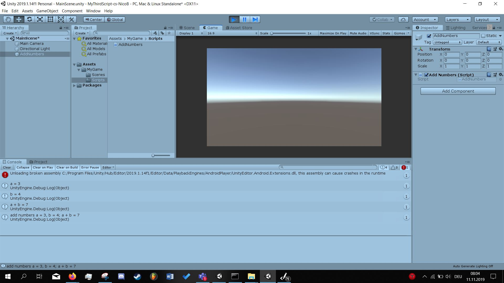

# MyThirdScript-cs-NicoB
**Development platform:** Windows 10, Unity 2019.1.f.14, Visual Studio Code

**Description:** 2d Project which prints out varibales and an addition of these 

**Target Platform:** WebGL

**Screenshots:**

 

**Lessons learned:** How to formate and design the README.md file and how to embedd screenshots, also get more advanced in printing out variables

**Copyright by NicoB**